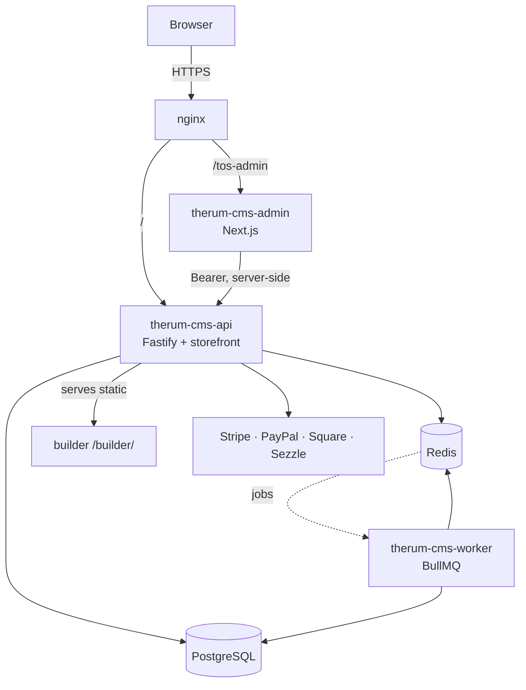

# Therum CMS 2.0 — "Counter"

A self-hosted commerce engine: a storefront, a headless commerce API, an admin
console, and a visual page builder — one product, one origin. It powers
production self-hosted storefronts.

**Stack:** Node 22 · TypeScript (ESM) · Fastify · Prisma 7 / PostgreSQL · Redis
(BullMQ) · Next.js 16 (admin) · Vite 8 + React 19 (builder). Money is stored in
integer minor units (cents) end to end. Version: `2.0.0-beta.8`.

## The three apps

| App | Path | Stack | Runs as | Serves |
|-----|------|-------|---------|--------|
| Backend + storefront | `src/` (root package) | Fastify + Prisma | `therum-cms-api` (PM2 cluster) | the public store + the `/api` surface |
| Worker | `src/worker.ts` | BullMQ | `therum-cms-worker` (PM2 fork) | scheduled backups, catalog sync, outbound webhooks, email |
| Admin | `admin/` | Next.js 16 | `therum-cms-admin` (PM2) | the operator console at `/tos-admin`, behind login |
| Builder | `builder/` | Vite + React | built to static, served by the backend | the visual page editor at `/builder/` |

The storefront's interactive JavaScript (checkout, buy box, wallets, cart,
account) is authored in `src/site/*.ts` and shipped as strings — see
[Testing](#testing) for why that has its own syntax gate.



## Quickstart

```bash
cp .env.example .env       # set a 32+ char JWT_SECRET, DATABASE_URL, REDIS_URL
npm install
npm run db:up              # Postgres :5433 + Redis :6380 via Docker
npm run prisma:migrate     # create the schema
npm run build              # dev/start run the compiled dist/ — build first
npm run dev                # watches dist/, http://localhost:4100
```

> `npm run dev` runs the **compiled** `dist/server.js`, so a build has to come
> first (or run `npm run build:watch` in a second terminal). To run straight
> from TypeScript with no build step, use `npm run dev:tsx` instead.

Health check: `curl localhost:4100/health`

### The admin and builder (optional, for the full product)

```bash
npm --prefix admin install && npm --prefix admin run dev     # :3100
npm --prefix builder install && npm --prefix builder run dev # :5174
```

## Configuration

Set in `.env` (see `.env.example` for the annotated list). `admin/.env` inherits
these and can override; its `JWT_SECRET` **must** match the backend's or every
admin login fails signature verification.

| Key | Required | Purpose |
|-----|----------|---------|
| `DATABASE_URL` | yes | PostgreSQL connection string |
| `REDIS_URL` | yes | Redis connection string |
| `JWT_SECRET` | yes | signs admin sessions and API tokens (≥32 chars; refused if a known placeholder in production) |
| `CREDENTIAL_KEY` | prod | AES key for encrypting stored provider credentials at rest |
| `WEBHOOK_SECRET` | prod | verifies inbound payment webhooks |
| `PUBLIC_ORIGIN` | prod | public base URL of the storefront (e.g. `https://yourstore.example`); used for absolute URLs in emails, SEO tags and webhooks (falls back to the request origin when unset) |
| `NODE_ENV` · `PORT` · `HOST` | no | defaults: development · 4100 · 0.0.0.0 |
| `LOG_LEVEL` · `CORS_ORIGINS` | no | pino level; comma-separated allowed origins |

## Testing

```bash
npm test               # full suite: node --test, against .env + docker services
npm run test:runtime   # node --check on every shipped storefront runtime string
npm run test:coverage  # the suite with V8 coverage
npm run typecheck      # tsc --noEmit
```

`npm run test:runtime` guards a specific trap: the storefront's browser JS lives
inside template-literal strings that `tsc` never parses, so a syntax error there
compiles clean and only breaks in the customer's browser. The gate extracts each
runtime string from `dist/` and runs `node --check` on it.

CI (`.github/workflows/ci.yml`) runs typecheck, build, the runtime gate, the
dependency audit and all three apps' type checks on every push and PR, with
Postgres + Redis service containers for the integration suite.

## Common scripts

| Script | Does |
|--------|------|
| `build` / `build:watch` | compile TypeScript to `dist/` |
| `dev` / `dev:tsx` | run compiled / run from source with watch |
| `start` | run `dist/server.js` (production entry) |
| `db:up` / `db:down` | start / stop the Docker Postgres + Redis |
| `prisma:migrate` / `prisma:studio` | migrate dev DB / open Prisma Studio |
| `seed` | seed the database |
| `mint-jwt` | mint a signed admin JWT for local API calls |

## Project layout

```
src/            backend + storefront (api/routes, services, counter/, site/, lib/)
admin/          Next.js operator console          → admin/README.md
builder/        Vite visual page editor           → builder/README.md
shared/         cross-app assets (design tokens)
prisma/         schema.prisma + migrations
test/           backend suite (node --test)
tools/          porting toolchain + runtime-check gate
scripts/        npm-wired helpers (mint-jwt, purge-test-fixtures)
deploy/         nginx + sudoers
docs/           architecture, deploy, audits, design specs
```

## More

- **Deploy:** [DEPLOY.md](DEPLOY.md) — build-gated rsync + PM2 reload.
- **Architecture:** [docs/ARCHITECTURE.md](docs/ARCHITECTURE.md).
- **Changelog:** [CHANGELOG.md](CHANGELOG.md).

Private repository. All rights reserved.
