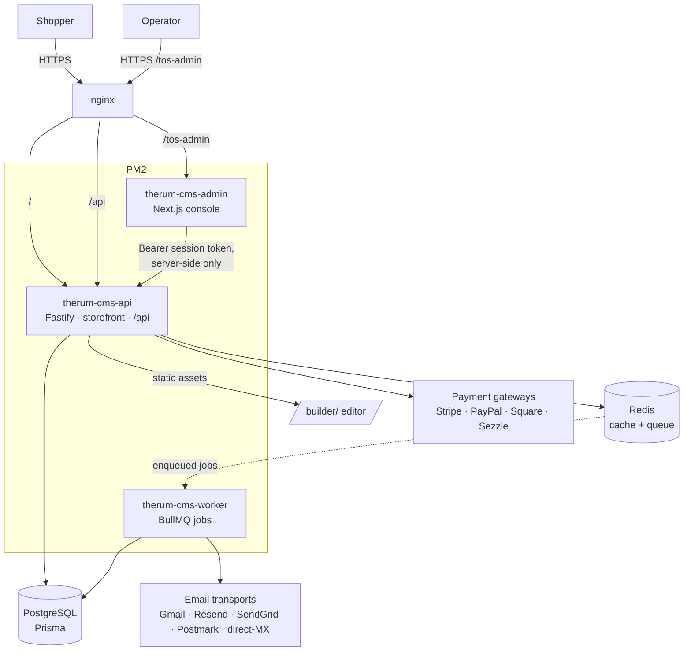

# Architecture — Therum CMS 2.0 ("Counter")

One product on one origin: a Fastify backend that also renders the storefront, a
Next.js admin console, a Vite page builder, and a BullMQ worker. PostgreSQL is
the system of record; Redis backs the cache and the job queue.

## Topology

## Processes (`ecosystem.config.cjs`)

| Process | Mode | Responsibility |
|---------|------|----------------|
| `therum-cms-api` | cluster | HTTP API + server-rendered storefront; binds `:4100` |
| `therum-cms-worker` | fork | scheduled DB backups, catalog sync, outbound webhooks, email delivery |
| `therum-cms-admin` | fork | Next.js console; binds `127.0.0.1:3100`, reachable only via nginx |

Postgres and Redis are managed services (Docker in dev, systemd/managed in
prod), not PM2 apps.

## Request paths

- **Storefront** (`GET /`, `/shop`, `/product/…`, `/checkout`) — rendered by the
  backend from `src/site/*`. Interactive behavior ships as browser JS embedded
  in template-literal strings (see below).
- **Commerce API** (`/api/*`) — Zod-validated Fastify routes in
  `src/api/routes/*`. Every error is `{ error: { code, message, field?, details? } }`.
- **Admin** (`/tos-admin/*`) — Next.js. Gated by `admin/proxy.ts`; calls the API
  server-side through `admin/lib/api.ts` with the operator's Bearer token.
- **Builder** (`/builder/*`) — static Vite bundle served by the backend.

## Data & money

- `prisma/schema.prisma` is the source of truth (48 models). Money is integer
  minor units everywhere; `src/counter/currency.ts` centralizes zero-decimal
  handling and `src/counter/totalsPipeline.ts` computes every total so the
  visible sum always equals its visible parts.
- Payment webhooks are ledgered then applied, idempotently
  (`src/services/paymentGateway.service.ts`); stock is reserved with an atomic
  guarded update (`src/services/order.service.ts`).

## The storefront-runtime pattern (and its gate)

The storefront's interactive JavaScript lives in backtick template-literal
strings inside `src/site/*.ts` (e.g. `CHECKOUT_FLOW_RUNTIME`,
`CARD_EVOLVE_RUNTIME`). `tsc` type-checks the surrounding `.ts` file but never
parses the string, so a syntax error there compiles clean and only fails in the
browser. `tools/runtime-check.mjs` (`npm run test:runtime`, and a CI step)
extracts every such string from `dist/` and runs `node --check` on it.

Two mobile-Safari rules that recur in this layer:
- Native payment sheets (`stripePR.show()`) must be called **synchronously**
  inside the tap — any `await` between the gesture and `show()` wedges the sheet
  on iOS.
- `aspect-ratio` on a stretch-aligned flex item renders deformed on Safari; use
  fixed dimensions for money-path UI.

## Security posture

- Sessions and API tokens are JWTs signed with `JWT_SECRET`; the admin and API
  must share it. `src/middleware/auth.ts` accepts only `admin`/`custom` roles —
  anything else fails closed.
- Stored provider credentials are AES-256-GCM encrypted at rest
  (`CREDENTIAL_KEY`); passwords use scrypt with the cost stored per hash.
- Credential-bearing query params (WooCommerce/OAuth1 transports) are masked in
  request logs; the production env gate refuses to boot on placeholder secrets.

## Deploy

Local `npm run build` (must exit 0) → `rsync` `src`/`admin` to the VPS →
`npm run build` on the box → `pm2 reload`. Build-gated: reload only after a
clean build. Full runbook in [DEPLOY.md](../DEPLOY.md).
